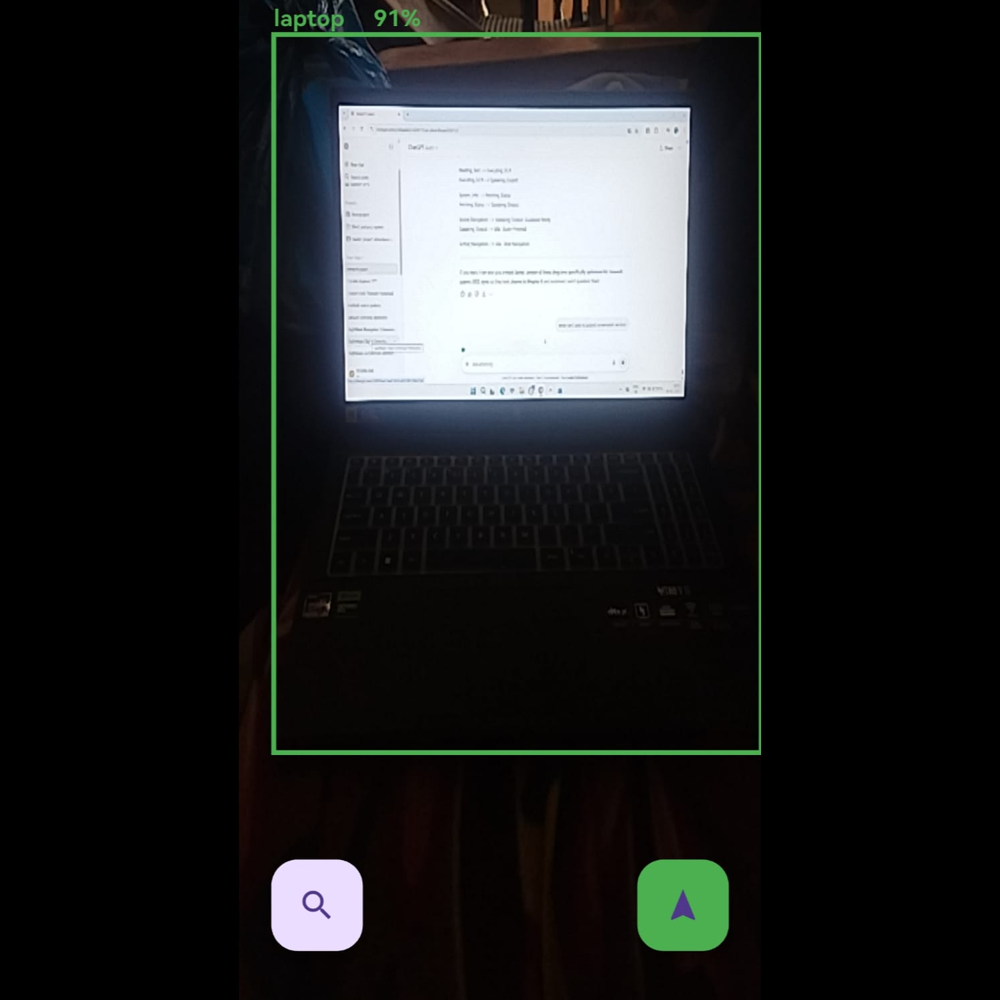
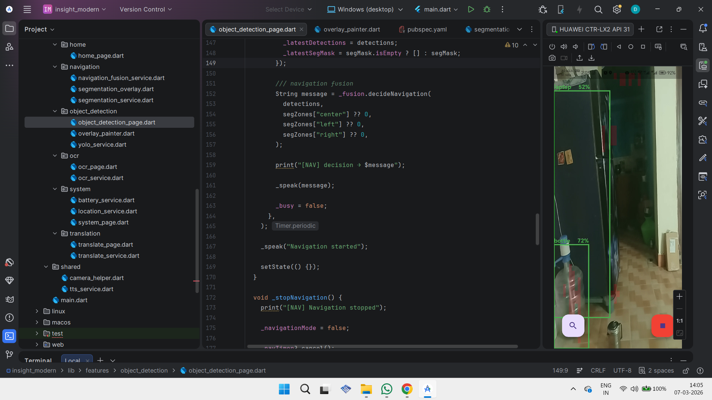
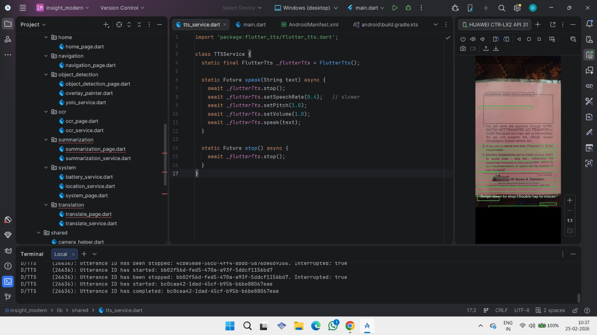
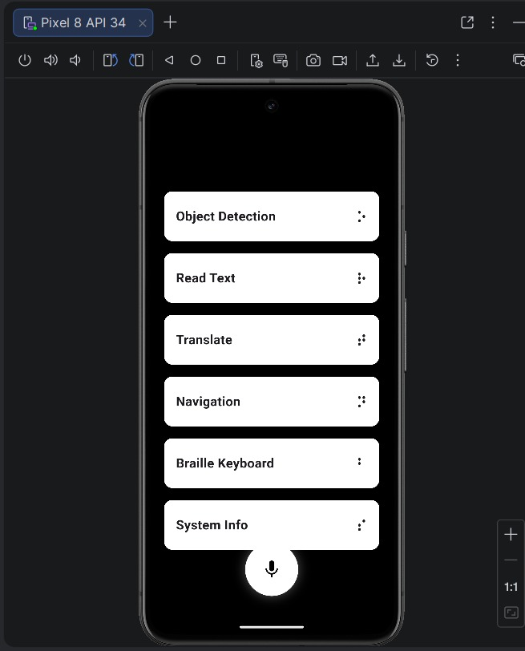
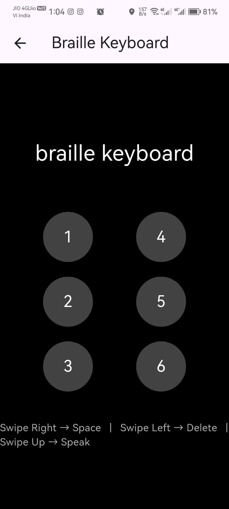

# SightMate – AI Assistant for the Visually Impaired

SightMate is an AI-powered mobile assistant designed to help visually impaired users navigate and interact with their surroundings using real-time computer vision and voice feedback.

---

## 🚀 Features

- 🎯 Real-time Object Detection (YOLOv8 TFLite)
- 🧭 Smart Navigation using Segmentation + Fusion
- 📖 OCR (Text Reading using ML Kit)
- 🎙️ Voice Assistant (Command-based interaction)
- ⠿ Braille Keyboard Input
- 🌍 Language Translation
- 🔋 System Info (Battery, Time, Location)

---

## 🧠 How It Works

Camera → YOLO Detection → Segmentation → Fusion Logic → Voice Feedback

---

## 🛠️ Tech Stack

- Flutter (UI + App)
- TensorFlow Lite (AI Models)
- YOLOv8 (Object Detection)
- Google ML Kit (OCR)
- Dart (Core Logic)

---

## 📸 Screenshots

### 🎯 Object Detection

### 🧭 Navigation

### 📖 OCR

### 🎙️ Voice Assistant

### 🎙️ Braille Keyboard

---

## 📂 Project Structure

lib/
├── core/
├── features/
│ ├── object_detection/
│ ├── navigation/
│ ├── ocr/
│ ├── assistant/
│ ├── braille/
│ ├── system/
│ ├── translation/

---

## 📈 Project Evolution

- Phase 1: Basic Blind Assistance System
- Phase 2: Added OCR and Voice
- Phase 3 (Current): Full AI Assistant with Navigation + Braille + YOLO

---

## ⚙️ Setup Instructions

1. Clone the repository: git clone https://github.com/DEEPAKRV07/SightMate-AI-Assistant.git
2. Navigate to project: cd SightMate-AI-Assistant
3. Install dependencies: flutter pub get
4. Run the app: flutter run

---

## 💡 Future Improvements

- GPS Navigation (Outdoor mode)
- Depth Estimation for distance awareness
- AI Chat Integration (Gemini / ChatGPT)
- Emergency SOS feature

---

## 👨‍💻 Author

Deepak R.V  
Gowtham S  
Harmithaa V  
